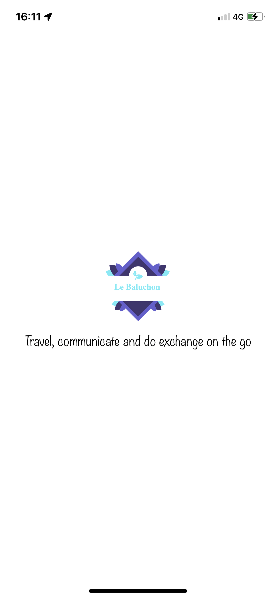
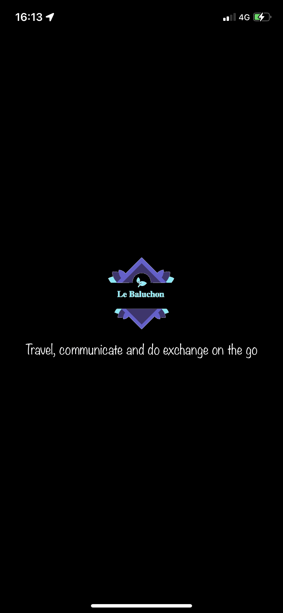
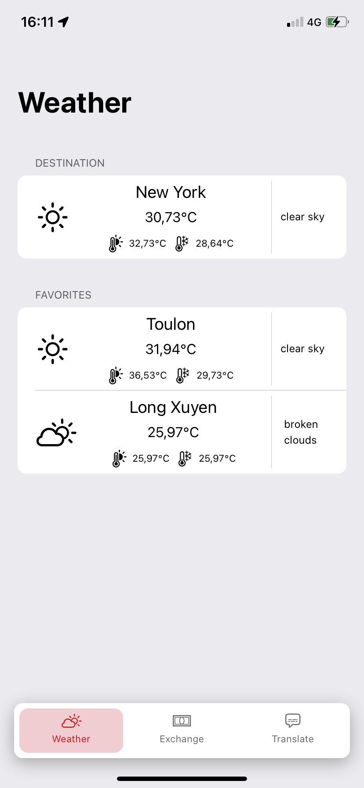
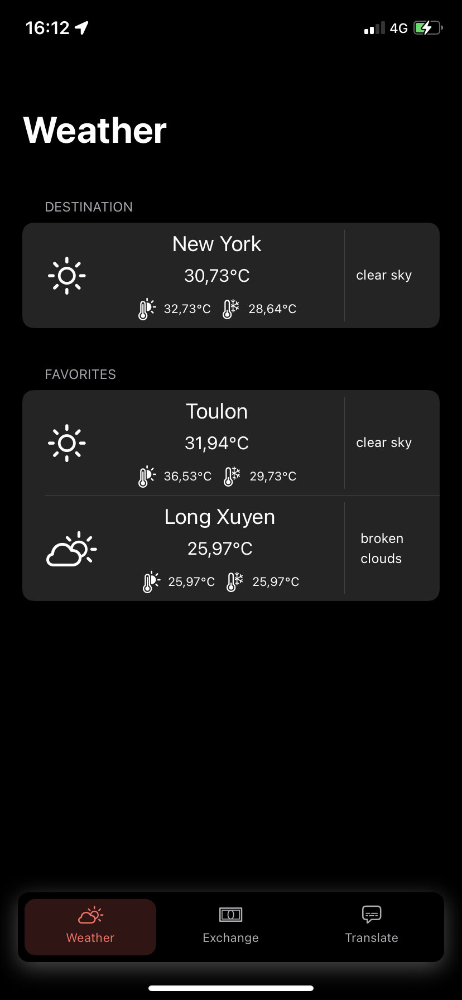
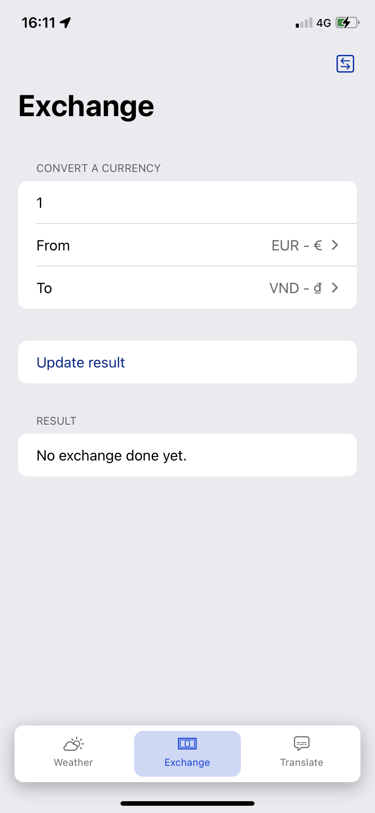
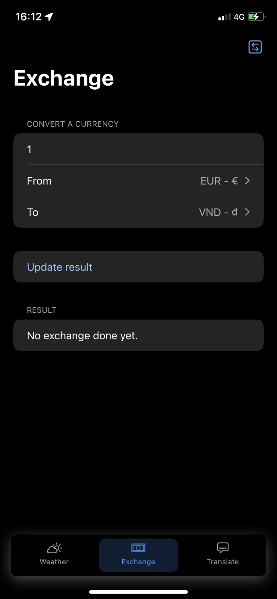
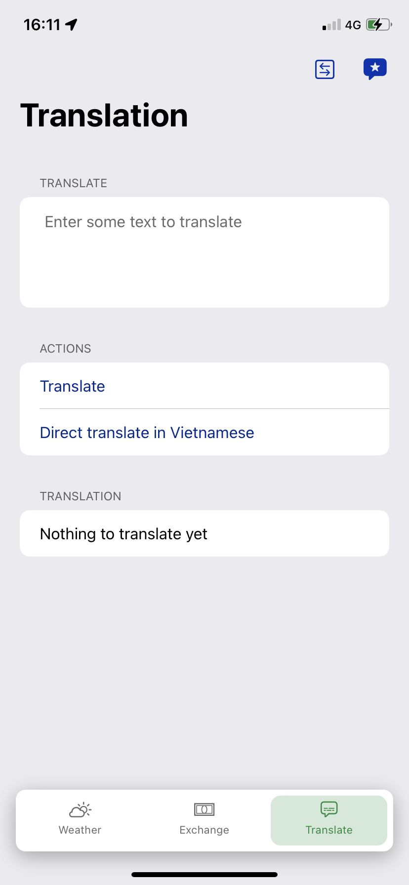
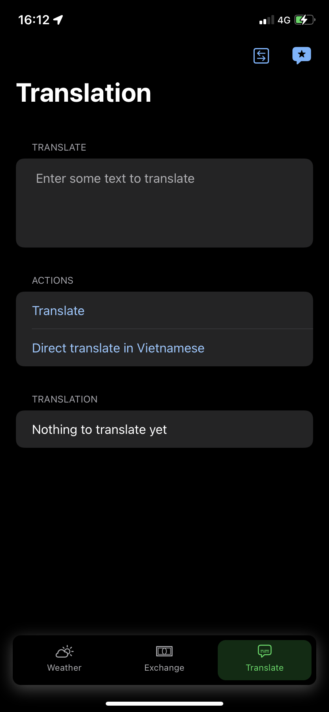

# Le Baluchon - Travel dude

 
 
 

## About the application
---
### Features available
- See weather
- Exchange money
- Switch currencies
- Change amount of change
- Translate text
- Auto source language text
- Select source language 
- Select target language

### Previews

#### LaunchScreen
LightMode            |  DarkMode
:-------------------------:|:-------------------------:
  |  

#### Weather
LightMode            |  DarkMode
:-------------------------:|:-------------------------:
  |  

#### Currency
LightMode            |  DarkMode
:-------------------------:|:-------------------------:
  |  

#### Translation
LightMode            |  DarkMode
:-------------------------:|:-------------------------:
  |  

### Quick demo
LightMode            |  DarkMode
:-------------------------:|:-------------------------:
|